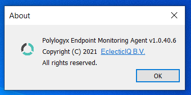
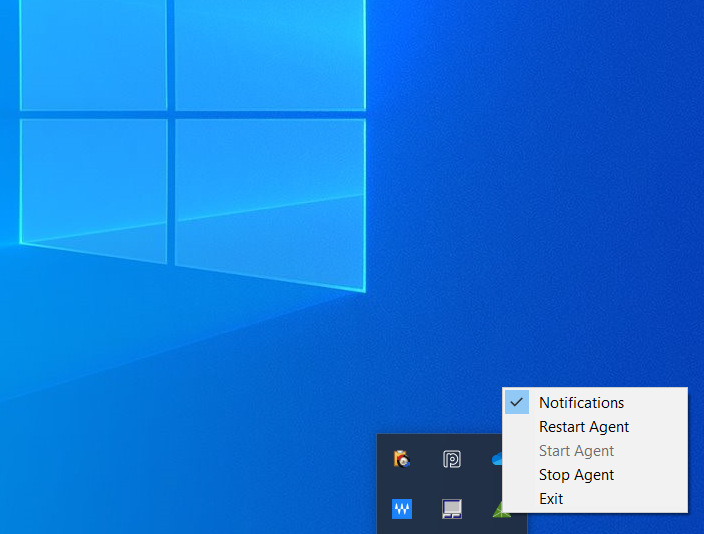
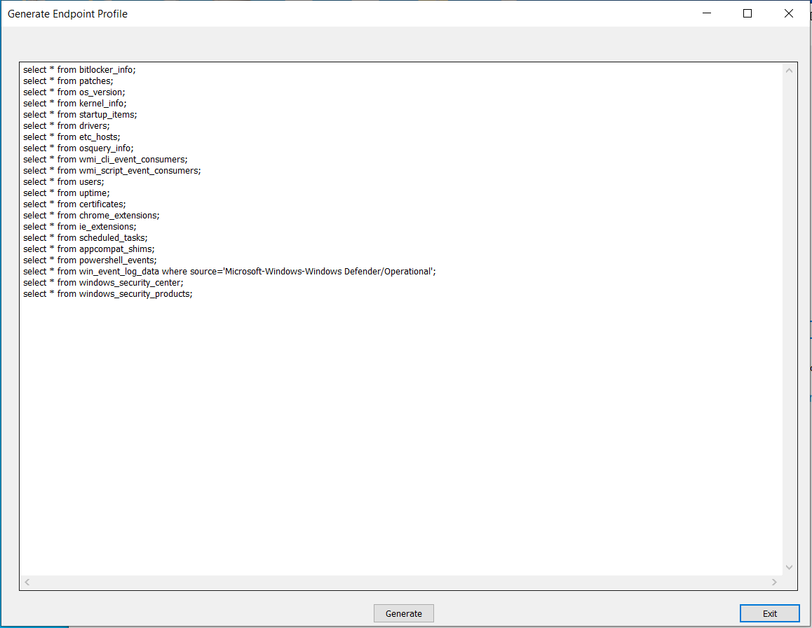
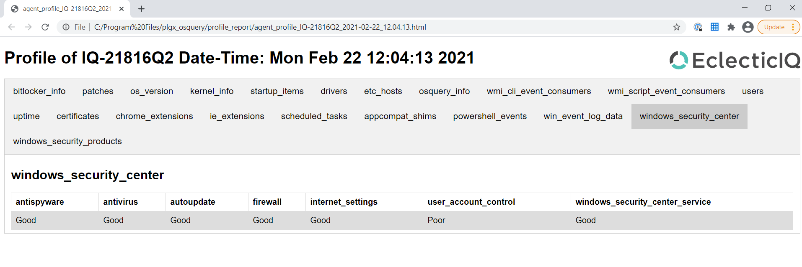

## Introduction 

PolyLogyx Monitoring Agent (PolyMon) is a Windows software that leverages the [osquery](https://osquery.io/) tool and the PolyLogyx Extension to osquery, to provide a view into detailed information about process creations, network connections, file system changes and many other activities on the system. For a detailed list of activities captured [check here](https://github.com/polylogyx/osq-ext-bin)

The software can be used for various threat monitoring and forensic purposes on a standalone system and does not mandate burden of having a server to manage the agents. It provides a graphical user interface that allows a user to navigate through the activities and events happening on the endpoint device.

## Install

Download the **PolyMon_Setup.exe** or clone the repository. The software can be installed by right click and 'Run as Administrator' on the binary executable. The current version is supported only on Windows 10 x64 Platform.

  

The setup wizard guides through the rest of the process.

The tool can be provisioned with an optional [VirusTotal](https://www.virustotal.com/) free API key. Provisioning with VirusTotal key allows the tool to fetch the reputation of file hashes automatically from it and alert in case a malicious (or supicious) detection.

At the end of the installation, the monitoring agent registers as a tray app and gets launched. Later you can close the tool window (it will keep running as tray app) or maximize the tool window by clicking on tray icon.

## Configuration

PolyMon is built with a default set of configurations for the underlying osquery agent as well as the [PolyLogyx Extension](https://github.com/polylogyx/osq-ext-bin). This provides an extremely low touch experience for the end user. The advanced users who wish to view/edit the configuration can do so by launching the PolyMon's front end application as shown below.

PolyMon configuration follows the similar syntax as provided for PolyLogyx Extension and osquery. 

## Use cases 

PolyMon tool can be used for a variety of use cases.

# Detection and monitoring

Under the hood, the PolyMon tool leverages a combination of technologies to record, query and display these activities. The most important use case is to provide a view into the activities of your system that are often not visible to naked eyes. These activities provide interesting insights for a system which can be used to root cause issues like a system breach, application misbehavior or any other unwarranted activity. Additionally, the tool can be utilized to query the properties of an endpoint. Each type of activity (or endpoint property) is provided under a tab that describes the type of activity. Each tab is a wrapper on a table provided by osquery core agent or PolyLogyx Extension. The default tabs are the 'activity monitoring' tabs. These activities include "File Events", "Process Events", "DNS Lookup", "HTTP Events" among others. The "search" box and the options on the right pane can assist with filtering the data for customizing the views.

If the tool was provisioned with VirusTotal key, it would look up the reputation of file hashes from VirusTotal database, maintaining a rate quota associated with free API keys, and trigger an alert on a match found. 

The alert notifications can be turned off (or on) from the menu in the tray app. A global search option allows to look for a particular files hash as collected by the PolyMon agent. 

Please keep in the mind that PolyMon DOES NOT index the entire disk. File hashes for only those file events as configured in the 'Configuration' are captured in the PolyMon. For file hashes of already resident files, the 'query' option as shown in the next section can be utilized. 

# Front-end for osquery 

For the advanced osquery users, the tool can act as graphical front end (much like the osqueyi shell) and can be used to send custom SQL queries on various osquery tables. 

# Endpoint Profiling 

A combination of osquery queries are clubbed together to generate an endpoint profile. These queries are listed below: 

The generated endpoint profile can be viewed as the HTML document.

## Uninstalling PolyMon

PolyMon can be uninstalled by removing the software from 'Programs and Features' or "Add/Remove" menu of the Windows control panel. 

## FAQ 

Q: What is the osquery version bundled with PolyMon 

Ans: The current release of PolyMon is bundled with osquery version 4.0.2 

Q. What is the version of PolyLogyx Extension bundled with PolyMon 

Ans: The current release of PolyMon is bundled with PolyLogyx Extension version 1.0.40.3 

Q. Can PolyMon be deployed, and monitored, through a central server? 

Ans: No. PolyMon is meant for a single computer usage. For getting the same functionality across a fleet of endpoints to be managed centrally, use PolyLogyx ESP. 

Q. Can PolyMon co-exist with osquery agent installed via other mechanism? 

Ans: It can, as long as the other osquery agent is not using PolyLogy Extension at the same time. 

Q. I only see some tabs filled with data while others are empty. Why?

Ans: The tool auto-populates the data for some event types (File, Process, Socket, DNS, DNS Response, SSL and Image Load). For other event tabs, the data is fetched by the push of "Refresh" button.

Q. Sometimes the UI hangs or shows 'Not responding'. Why?

Ans: This can happen if the query triggered is computing high volume of data. Waiting for a few seconds will resolve the issue.

Q. What is the license for using, or distributing, PolyMon. 

Ans. PolyMon is a freeware but licensed. All rights belong to EclecticIQ B.V. Please refer to the License file in the repository for detailed criteria. 