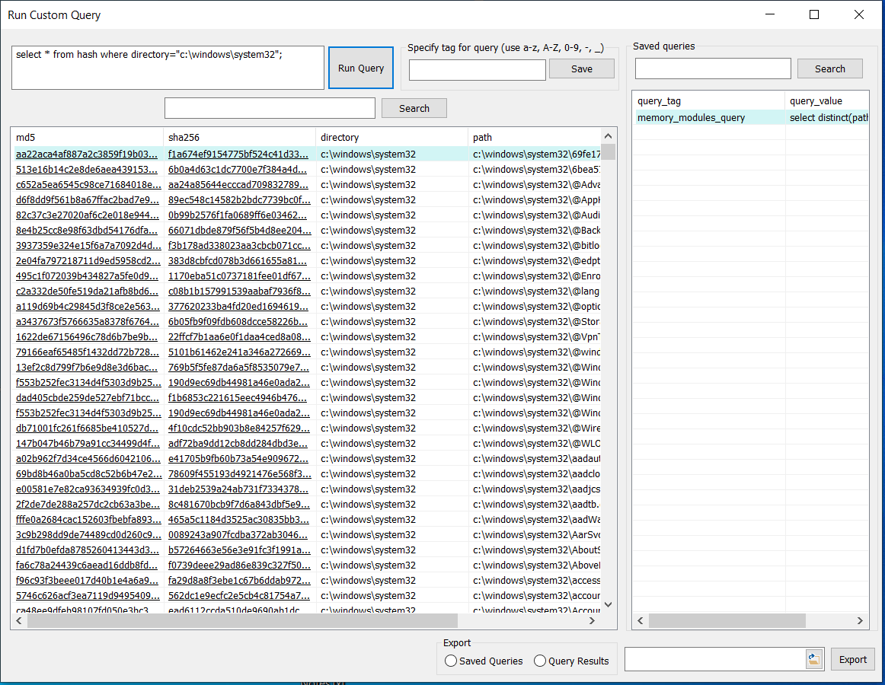
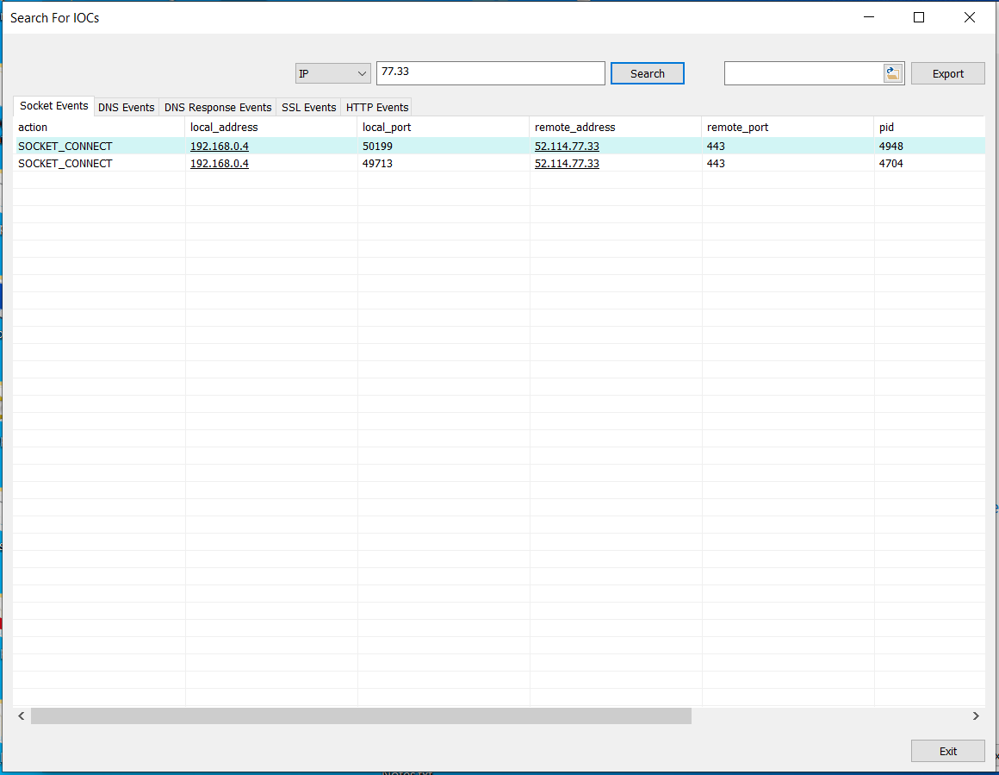
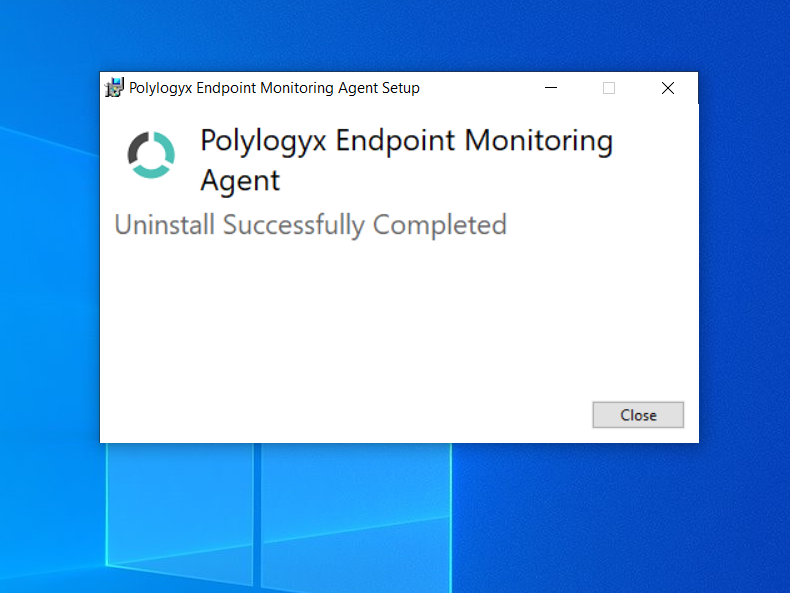

# Introduction 

PolyLogyx Monitoring Agent (PolyMon) is a Windows software that leverages the [osquery](https://osquery.io/) tool and the PolyLogyx Extension to osquery, to provide a view into detailed information about process creations, network connections, file system changes and many other activities on the system. For a detailed list of activities captured [check here](https://github.com/polylogyx/osq-ext-bin)

The software can be used for various threat monitoring and forensic purposes on a standalone system and does not mandate burden of having a server to manage the agents. It provides a graphical user interface that allows a user to navigate through the activities and events happening on the endpoint device.

# Installation (or Upgrade)

Download the **PolyMon_Setup.exe** or clone the repository. The software can be installed by right click and 'Run as Administrator' on the binary executable. The current version is supported only on Windows 10 x64 Platform.

  

The setup wizard guides through the rest of the process.

You can choose to install Everything tool for Desktop Search feature (selected by default via checkbox).
If you choose not to install Everything tool for Desktop Search feature, the "Desktop Search" feature will remain DISABLED and cannot be ENABLED later.

The tool can be provisioned with an optional [VirusTotal](https://www.virustotal.com/) free API key. Provisioning with VirusTotal key allows the tool to fetch the reputation of file hashes automatically from it and alert in case a malicious (or supicious) detection. (available on Install only)

At the end of the installation, the monitoring agent registers as a tray app and gets launched. Later you can close the tool window (it will keep running as tray app) or maximize the tool window by clicking on tray icon.

# Configuration

PolyMon is built with a default set of configurations for the underlying osquery agent as well as the [PolyLogyx Extension](https://github.com/polylogyx/osq-ext-bin). This provides an extremely low touch experience for the end user. The advanced users who wish to view/edit the configuration can do so by launching the PolyMon's front end application as shown below.

PolyMon configuration follows the similar syntax as provided for PolyLogyx Extension and osquery. 

# Use cases 

PolyMon tool can be used for a variety of use cases.

## Detection and monitoring

Under the hood, the PolyMon tool leverages a combination of technologies to record, query and display these activities. The most important use case is to provide a view into the activities of your system that are often not visible to naked eyes. These activities provide interesting insights for a system which can be used to root cause issues like a system breach, application misbehavior or any other unwarranted activity. Additionally, the tool can be utilized to query the properties of an endpoint. Each type of activity (or endpoint property) is provided under a tab that describes the type of activity. Each tab is a wrapper on a table provided by osquery core agent or PolyLogyx Extension. The default tabs are the 'activity monitoring' tabs. These activities include "File Events", "Process Events", "DNS Lookup", "HTTP Events" among others. The "search" box and the options on the right pane can assist with filtering the data for customizing the views.

If the tool was provisioned with VirusTotal key, it would look up the reputation of file hashes from VirusTotal database, maintaining a rate quota associated with free API keys, and trigger an alert on a match found. 

The alert notifications can be turned off (or on) from the menu in the tray app. A global search option allows to look for a particular files hash as collected by the PolyMon agent. 

Please keep in the mind that PolyMon DOES NOT index the entire disk. File hashes for only those file events as configured in the 'Configuration' are captured in the PolyMon. For file hashes of already resident files, the 'query' option as shown in the next section can be utilized. 

## Front-end for osquery 

For the advanced osquery users, the tool can act as graphical front end (much like the osqueyi shell) and can be used to send custom SQL queries on various osquery tables. 

## Endpoint Profiling 

A combination of osquery queries are clubbed together to generate an endpoint profile. These queries are listed below: 

The generated endpoint profile can be viewed as the HTML document.

# New features and enhancements over previous release

## Integration with Everything tool (https://www.voidtools.com/) to enable Desktop Search for files and get file hashes.

   
   You can click on Desktop Search tab and search for any files on the entire system (with regex support enabled by default). 
   With the help of Everything service, PolyMon will display all search results. 
   Further on clicking "Get File Hash", PolyMon will fetch the hashes of searched files and display alongwith file names.
   These results can be exported into a csv file via Export button.	Just browse any location and provide file name, then click "Export".

## Search for IOCs - added support for searching IP address within Polylogyx event tables.

   
   
   You can now search for any IP (or substring) which will display matches in Socket, SSL, DNS, DNS Response and HTTP events 
   in a single tab separated view.   

## Menu option to add/update VirusTotal key.

   
      
   If you didnt opt to add VirusTotal key while installing previous version, no worries. 
   It can be updated now and will be activated immediately to fetch file hash reputations in File Events.

## Save Custom Query with tags for future use. 

   
   Any custom query can be saved with a tag and will be displayed on the right side of the window. 
   You can double click any saved query and copy it to run again in future.

## Ability to export results in list view (csv format) with VirusTotal url links for hashes, domains, IPs. 

   Any list view can be exported into a csv formatted data for further analysis.
   VirusTotal url links will also be exported for columns having hashes, domains or IPs.

## Ability to Start/Stop/Restart Polylogyx agent via Tray menu. 
   

   You can Start/Stop/Restart Polylogyx Agent services just by a click in Polylogyx Tray Icon menu options.

## Osquery service updated to version 4.5.0

   plgx_osqueryd.exe service, the osquery daemon shipped with PolyMon is now updated to version 4.5.0. 

## New tables added in osquery 4.5.0 added in dropdown list for "Other Tables"

   All tables recently added by osquery (supported only on Windows) in 4.5.0 version have been updated in the list. 

## Endpoint Profile report enriched with host encryption and security status. 

   
## UI enhancements

- Window maximize, minimize and resize allowed.
- Shortcut keys for dialogs such as Ctrl+R to launch "Run Custom Query" dialog. 
- Selected row in list view is highlighted
- View Row Data of list view on doubl click any row into a popup dialog (text in popup dialog can be copied by selecting text and Ctrl-C)
- List view columns with hash, domain or IP are clickable links to VirusTotal page for reputation details. 
- Rebranding with EclecticIQ company logo
- Show/Hide columns in list view on right click list view's top row having column names

# Uninstalling PolyMon

PolyMon can be uninstalled by removing the software from 'Programs and Features' or "Add/Remove" menu of the Windows control panel. 

Note: During uninstall, PolyMon will stop Everything service. You can restart it running "sc start everything" from administrator command prompt. 
Though the installer tries to cleanup all the files in case of failure, if it doesn't you can run polymon_cleanup.bat from command prompt with admin privileges to cleanup the installed files.

# FAQ 

Q: What is the osquery version bundled with PolyMon 

Ans: The current release of PolyMon is bundled with osquery version 4.5.0

Q. What is the version of PolyLogyx Extension bundled with PolyMon 

Ans: The current release of PolyMon is bundled with PolyLogyx Extension version 1.0.40.4

Q. Can PolyMon be deployed, and monitored, through a central server? 

Ans: No. PolyMon is meant for a single computer usage. For getting the same functionality across a fleet of endpoints to be managed centrally, use PolyLogyx ESP. 

Q. Can PolyMon co-exist with osquery agent installed via other mechanism? 

Ans: It can, as long as the other osquery agent is not using PolyLogy Extension at the same time. 

Q. I only see some tabs filled with data while others are empty. Why?

Ans: The tool auto-populates the data for some event types (File, Process, Socket, DNS, DNS Response, SSL and Image Load). For other event tabs, the data is fetched by the push of "Refresh" button.

Q. Sometimes the UI hangs or shows 'Not responding'. Why?

Ans: This can happen if the query triggered is computing high volume of data. Waiting for a few seconds will resolve the issue.

Q. Can the tool work with a commercial VirusTotal API?

Ans: It can but the tool would still maintain the lookup rate of a free API (i.e. 4 per minute).

Q. Who is the publisher/owner of the tool? PolyLogyx or EclecticIQ?

Ans: PolyLogyx (and all its technology products) are part of EclecticIQ. 

Q. I have a feature request (or a bug to report). How do I do so?

Ans: Easiest way would be to create an issue on github.

Q. What is the license for using, or distributing, PolyMon?

Ans. PolyMon is a freeware but licensed. All rights belong to EclecticIQ B.V. Please refer to the License file in the repository for detailed criteria. 

Q. I already have Everything tool installed. Do I still need to select option to install Everything tool via PolyMon installer for Desktop Search?

Ans: If Everything tool is already installed on your system while you are installing PolyMon, it will be ignored for enabling "Desktop Search".
	 This means, to enable Desktop Search feature, you have to select checkbox to install Everything tool for Desktop Search feature.
